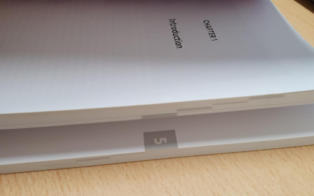

# Thesis chapter block stamp creator

Thesis chapter block stamps are these things:

They seem to be on nearly every thesis these days, which is fair, because they look quite good and actually make it a bit nicer to navigate around the thesis quickly.

The most common way of adding these block stamps to your manuscript is apparently to pay a design/typesetting company to generate them for you. While I wouldn't normally mind people making money on simple scripts that they wrote, I got tricked into attending a 45 minute marketing pitch for one of these companies under the guise of a "thesis design workshop" and left with a minor grudge. Hence, I figured I'd just write my own script and open source it.

# Requirements

- bash (4.0+)
- qpdf
- python
- matplotlib

# Usage

First, edit `chapter_page.txt` to specify the first and last page of each chapter. Then, run `./stamp_my_thesis.sh your_thesis.pdf` and enter the bleed width of your document in millimetres. The result is saved to `result_your_thesis.pdf`.

Note: the script assumes you have 16 or fewer chapters; any more, and the stamps start dropping off of the page. If so, edit the python script to generate smaller block stamps, or just edit the increment to have them partially overlap vertically. 
